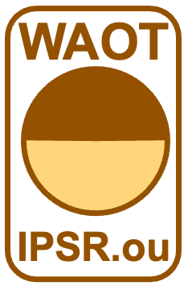

# WAOT

WAOT is a collaborative research team in <b>IPSR, Okayama University</b> mutually working with <i>Xenopus laevis</i> oocyte as a material. We are the oocyte team.

This WAOT GitHub repository contains a <b>FIJI macro</b> and two <b>R scripts</b>, which support analyses of the Xenopus oocyte swelling assay conducted with the microscope settled as a common facility in IPSR, Okayama University.

Files posted in this repository are:
+ Oocyte_swelling_assay.ijm
+ Split_oocyte_data_10each-3.R
+ Calcuration of Pf_imageJ.R
  

# About macros/scripts in this repository

<b>Oocyte_swelling_assay.ijm</b>

FIJI (Fiji Is Just imageJ) Macro to measure projected areas of oocytes

卵母細胞の投影面積を計測するFIJI用のマクロ

(For non Japanese-speaking members, please use translation software to read followings)

このマクロはFIJIでもImageJでも同様に動作すると考えられていますが，FIJIでのみ動作確認しています．FIJI / ImageJを使いますので，WindowsでもMacでも，32bitでも64bitでも最新OSでも古いバージョンでも関係なく動作します．

<b>Split_oocyte_data_10each-3.R</b>

R script to separate each 10 data of the outputs of the FIJI measurement of the projected areas of oocytes

何列も並んだOocyteの投影面積の結果を10個づつのデータに切り分けるためだけのRスクリプト

(For non Japanese-speaking members, please use translation software to read followings)

柴坂さんのAutolistを用いてスタック化したファイルリストを用いてWinroofで面積を測定すると，それぞれの測定ごとに異なるファイルに結果が保存されます．これの整理は結構面倒ですよね．森のOocyte swelling assayマクロは全ての結果が何百行もわたり縦に並ぶので，手作業でそれを整理するのが面倒です．このRスクリプトはOocyte swelling assayで測定した結果を10このデータごとに切り分けて，横に並べるためのスクリプトです．柴坂さんの方法で得た結果を卵の数だけ何十回も手動でひとつのエクセルファイルにコピペしていくのとほぼ同じ作業が1秒以内で完了します．Rを使っていますので．WindowsでもMacでも，32bitでも64bitでも最新OSでも古いバージョンでも関係なく動作します．

ただし，Rのパッケージのひとつであるopenxlsxを使いますので，openxlsxに対応していないバージョンのRではエラーがでます．うまくいかない場合は，最初にopenxlsxのバージョンを疑ってください．また，openxlsxが新しくなった際に，現在のスクリプトが対応しなくなってしまう可能性がゼロではありません．openxlsxと同様にdplyrが新しくなって対応しなくなってしまう可能性がゼロではありません．不都合があれば作者（森）にお知らせください（emailもしくはpull requestで）．

<b>Calcuration of Pf_imageJ.R</b>

R script to calculate Pf from the projected areas of oocytes

Pfを計算するRスクリプト

(For non Japanese-speaking members, please use translation software to read followings)

Image Jで投影面積を測定した場合に使うスクリプトとWinRoofで投影面積を測定した場合に使うスクリプトの2つがあります．取得した画像を処理する際の画像解像度が異なるため，間違えたスクリプトを使うと，誤った面積が求められます．（Fijiで投影面積を計算した結果を使う場合は「Calculation of Pf_imageJ.R」を使ってください．Winroofで投影面積を計算した結果を使う場合は「Calcuration of Pf_winroot.R」を使ってください．違いはWinRoofでは画像を16-bit画像のまま計算するのに対して，FIJI（ImageJ）では画像を8-bitに変換して計算するため，計算結果にずれが生じることです．それぞれのスクリプトを使うとずれが補正され，結果はほぼドンピシャで同じPf値になります．）

このRスクリプトは10個あるいはそれ以下の数のOocyteの投影面積からPfを求めるためのスクリプトです．Rを使っていますので．WindowsでもMacでも，32bitでも64bitでも最新OSでも古いバージョンでも関係なく動作します．現在のカメラ（CoolSnap）と画像取り込みソフト（MetaView）の取り込み画像の解像度に合わせてスクリプトを組んでいます．画像の解像度が変わった時には計算式内の数値を書き直す必要があります．操作に変更があった場合は森まで知らせてください（emailもしくはpull requestで）．

# Installation

<b>Oocyte_swelling_assay.ijm</b>

WindowsでもMacでも方法は基本的に同じです．

FIJI.appの存在するフォルダ内に，Macroファイル（Oocyte_swelling_assay.ijm）をコピーします．

1. Macの場合：FIJI.appをダブルクリックするとFIJIアプリが立ち上がり，フォルダは開けません．ここでは「Control」を押しながらアイコンをクリックし「パッケージの内容を表示」を選びます．
Windowsの場合：Fiji.appをダブルクリックするだけでFiji.appフォルダが開きます．FIJIアプリを立ち上げるためには，さらにImageJ-win64.exe（64ビットの場合）をダブルクリックします．
2. 開いたフォルダの中に「Macros」という名前のフォルダがありますが，マクロファイルをコピーする場所はここではありません．
Fiji.app>plugins>Macros の中にコピーします．
Macrosフォルダが違う階層に2つあります．pluginsの中のMacrosに保存しなければいけません．ちょっとしたトラップです．
3. もしすでに，FIJIが立ち上がっている場合には一度再起動してください．ソフトウェアが起動する際にFIJIにマクロが読み込まれます．
4. FIJIを立ち上げて，プルダウンメニューのPlugins>Macrosのなかに「Oocyte swelling assay」と表示されたら成功です．メニューの下の方に表示されるかもしれません．
 
（注）FIJIのMacroの名前はアンダースコア（下線）を入れる必要があるそうです．このためこのマクロの名前は「Oocyte_swellng_assay」となっています．ImageJではFIJIとインストール方法が異なるとどこかの記事で読みました．FIJIにマクロを読み込ませると，プルダウンメニューにはアンダースコアが消えた「Oocyte swelling assay」が表示されます．

<b>Split_oocyte_data_10each-3.R</b>
1. RおよびRstudioがすでにコンピュータに入っている場合はパッケージのインストールに進んでください．入っていない場合は，史料館でRに関する書籍を借りて，それを参考にしてRとRstudioをインストールしてください．難しくないはずです．
2. このRのスクリプトでは3つのパッケージを利用しています．これら3つのパッケージをインストールします．すでにインストールされている場合には準備完了ですので，ダウンロードしたスクリプトを実行してください．
   + RStudioでパッケージをインストールする方法はひとつではありません．いくつものやり方があり，それぞれ優劣はありません．ここではそのうちひとつのやり方のみを説明します．
   + RStudioを起動し，プルダウンメニューのTools>Install Packages...を選ぶと，ダイアログが表示されます．Install fromはRepository (CRAN)を選択してください．Packagesにインストールするパッケージの名前を入力します．今回はdplyrとstringrとopenxlsxという3つのパッケージをインストールしますので，Packagesの入力欄に「dplyr, stingr, openxlsx」とコンマで区切って入力します．Installボタンを押すとインストールが開始し，自動的に終了します．
3. リンクのファイルをダウンロードして，任意のフォルダに保存してください． 拡張子が.Rのファイルです．このファイルをダブルクリックすると自動でRStudioが起動してすぐにスクリプトを使える状態になります．準備完了です．

<b>Calcuration of Pf_imageJ.R</b>
1. RおよびRstudioがすでにコンピュータに入っている場合は準備完了です． Rにもともと入っているコマンドのみを使うため，新たなパッケージのインストールは必要ありません． 準備完了です．

# How to use

<b>Oocyte_swelling_assay.ijm</b>
1. 準備: 保存されたoocyteの写真をひとつのフォルダに保存してください．Oocyte swelling assay Macroには自動でフォルダ内のファイルを読み取る機能があります．Oocyteの写真以外のファイルがあると，うまく機能しない可能性があります．もし写真がスタック化されていると，スタックの一枚目の写真のみが解析されます．これはこのMacroの仕様です．現在は写真をスタック化しないで測定していると思います．今後，何かの都合でスタック化する必要が生じた場合には，Macroを更新（書き換え）する必要があります．ちなみに柴坂さんがつくったAutolistは写真をスタック化する作業をするスクリプトです．Winroofではスタック化したTIFFを解析する仕様のためAutolistが必要だったんだと思います．FIJIのマクロでも連続画像のスタック化をしようと思えばできます．
2. マクロの起動: FIJIのメニューPlugins>Macros>Oocyte swelling assayを選んでください．
3. 解析する画像の選択: マクロを起動すると，フォルダを選ぶダイアログが表示されますので，oocyteの写真を保存したフォルダを選択して下さい．
4．面積の自動測定: なにも操作せずとも，自動で面積を測定します．Oocyteの写真が表示されたり消えたり，黄色い枠線が表示されたり画面が忙しくなります．
5. 結果の表示: FIJIのResultsウィンドウが現れ，画像ファイル名と面積が自動的に表示されます．これをSave asで保存してください．
6. 結果の分析: 保存されたファイルはMS Excelなどで開くことができますので，体積変化を計算してください．
結果は縦に一列に並んでいます．解析しやすいように，0秒から90秒までの10秒刻みの10個のデータを1個毎に切り分けるには，「2. R script to separate each 10 data of the outputs of the FIJI measurement of the projected areas of oocytes」を使ってください．

<b>Split_oocyte_data_10each-3.R</b>
1. .Rファイルをダブルクリックすると，Source Editor（RStudioの左上の画面）にスクリプトが表示されます．
2. スクリプトの全文をマウスで選択します．
3. Source Editor画面の右上の緑三角ボタンを押します．
4. ダイアログが表示されるので，OocyteのResultsファイルを選択します．
5. 結果が自動的に保存されます．

＜結果ファイルが保存される場所＞

RStudioのConsol（左下の画面）の最後にファイルが保存されたディレクトリが表示されるようになっています．TaroさんがユーザーであるMacの場合 「/User/Taro/」 のようにディレクトリが表示されるかもしれません．通常はRのWorking Directoryに保存される仕様になっています．しかし，どこが現在のWorking directoryかわからなくなることが頻繁に起きますので，ファイルが迷子になったら，表示されるディレクトリを参考にしてください．
 
ちなみに現在のWorking directoryを調べるRのコマンドは getwd() です．Working directoryを変更するコマンドは setwd() でカッコの中にディレクトリを記載します．WindowsとMacでディレクトリのパスが異なるので，このスクリプトではsetwd()コマンドを使っていませんが，いつも自分が決めたフォルダに結果を保存する場合は，setwd()コマンドをスクリプト内の適当な場所に挿入してスクリプトを実行すると最初から保存したいフォルダ/ディレクトリを指定することができます．
 
＜結果ファイルの数と種類＞

結果ファイルは2つ作られます．ひとつは<b>切り分けた結果のファイル</b>．もうひとつはそれぞれの測定（0秒から90秒まで）の10枚のファイルの結果の<b>相関係数</b>が保存されています．

<b>切り分けた結果のファイル</b>はPfの計算に使ってください．<b>相関係数のファイル</b>はoocyteが直線的に膨張したかどうかの目安に使ってください．私の経験では r値が0.98より大きい場合は完全に直線ですのであらためてグラフをチェックする必要がないほどです．0.95以上の場合も問題ないと思いますが，一度グラフを目で確認してください．0.8未満は概ね使えないデータと考えて良いと思います．どんなエラーがあったのか写真をもとに考えてみても良いかもしれません．0.8から0.95の間の場合は，途中で破裂した場合や，最初にoocyteが動いてしまうなどの影響で，最初のデータもしくは後半のデータに異常が出ていることが散見されます．この場合は目でグラフをチェックして，異常データの部分を取り除いて，直線成分だけでPfの計算ができるか，判断してください．
 
＜保存された結果ファイルの名前＞

たくさん解析するとどのファイルがなんだかわからなくなってしまいがちです．そこで，ファイルの名前はRsultsのあとに解析した年月日時分をつけるようにしてあります．保存形式は.xlsxです．切り分けた結果はResults_2001-12-31_18-15.xlsxのように表示されます（2001年12月31日18時15分の場合）．相関係数の結果のファイル名はResultsCor_2001-12-31_18-15.xlsxのようになります．日時分が名前に反映されるので，1日に何度解析してもどのファイルがどの結果か分かりやすくなっています．1分以内に連続して作業すると，ファイル名が重なるため，予期しない結果になります．

<b>Calcuration of Pf_imageJ.R</b>

1. データの準備 
   + 最初の面積（通常は0秒の面積）
   + 測定終了時の面積（破裂などしない場合は90秒の面積）
   + 測定時間（0秒から90秒の場合は測定時間を90とします．Oocyteが破裂して50秒までしか測定しない場合は50としてます．最初にズレた場合などは0秒の値を削除しますが，この場合は10秒の値を最初の面積として，撮像回数 x 10秒の値が測定時間となります．） 
   + 浸透圧の差（1/5 MBSを使った場合 160 mOsm, 1/4 MBSを使った場合 150 mOSM, 1/2 MBSをつかった場合 100 mOsmと入力します．） 
   + 注意点! 一度の計算で，50個でも100個のOocyteでも同時に計算できます．森がスクリプトを書き換えれば，測定時間が異なるデータや浸透圧差が違う測定結果も一度に計算することができますが，現在は「0-90秒」および1/5 MBSの計算がほとんどだと思うので，対応していません．一度の計算では測定時間と浸透圧差を統一して計算してください（80秒, 70秒などの結果は分けて計算してください．要望があれば書き換えます．

2. データの入力 （このスクリプトでは，たとえばエクセルやCSVなどの外部ファイルをRの機能を使って読み込むことはせず，スクリプトの中に必要な４つのデータを直接コピペで入力します．） 
   + スクリプトファイル「Calcuration of Pf_imageJ.R」をダブルクリックします． 
   + 必ず入力する項目 / Must input data 最初の面積（A0），90秒後（あるいは測定最後）の面積（A90) 
   + 条件によって変更する項目 / Optional 測定時間（Period of assay），浸透圧差（Dif_in_Osm）

3. スクリプトの実行
   + データのコピペがすんだら，スクリプト全体を選択して，Runボタンを押す． 
   + 結果が「Pf_results.csv」というファイルで保存されます．計算されたPfはPf_valというカラムに表示されます．ファイル名に日時分などが表示されない仕様になっています．
   + 結果ファイルの保存場所: RStudioのConsol（左下の画面）の最後にファイルが保存されたディレクトリが表示されるようになっています．TaroさんがユーザーであるMacの場合 「/User/Taro/」 のようにディレクトリが表示されるかもしれません．通常はRのWorking Directoryに保存される仕様になっています．しかし，どこが現在のWorking directoryかわからなくなることが頻繁に起きますので，ファイルが迷子になったら，表示されるディレクトリを参考にしてください． ちなみに現在のWorking directoryを調べるRのコマンドは getwd() です．Working directoryを変更するコマンドは setwd() でカッコの中にディレクトリを記載します．WindowsとMacでディレクトリのパスが異なるので，このスクリプトではsetwd()コマンドを使っていませんが，いつも自分が決めたフォルダに結果を保存する場合は，setwd()コマンドをスクリプト内の適当な場所に挿入してスクリプトを実行すると良いと思います．◾️
